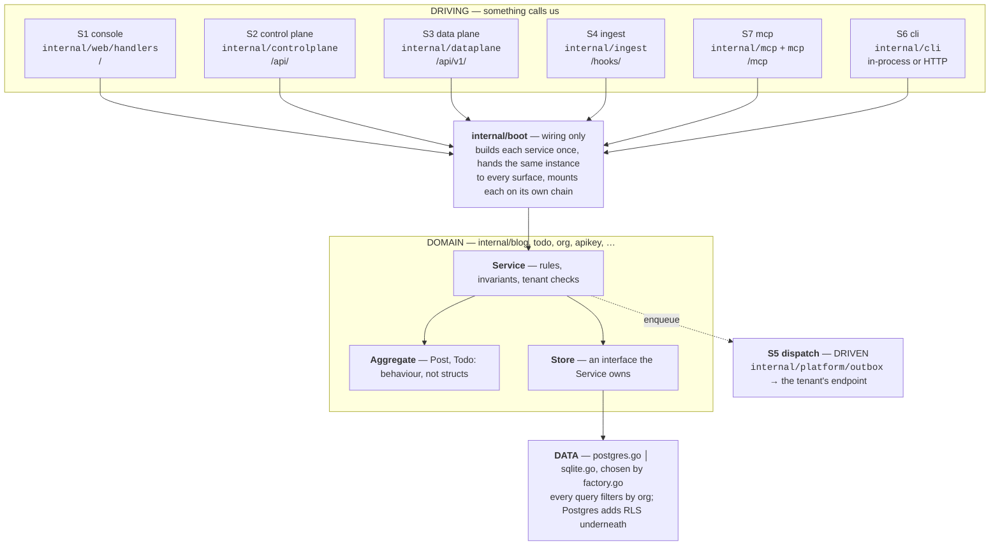

# Architecture

One listener, seven surfaces, one set of domain services, one store per module.

A **surface** is a way in or out. A **module** is a bounded context. Surfaces hold no business
logic; modules never know which surface called them. They meet only in `internal/boot`.

## Layers

Each driving surface gets **its own middleware chain** — `web.SurfaceChains{Console, Control,
Data, Ingest, MCP, Probes}`. There is no global chain, so an SSR gate can never be reached from
a machine surface.

## Reuse is an instance, not a pattern

Four surfaces publish blog posts. All four reach the same `*blog.Service`:

| Surface          | Entry                          | Route to the service                     |
| ---------------- | ------------------------------ | ---------------------------------------- |
| S1 console       | `web/handlers/blog.go`         | direct                                   |
| S2 control plane | `controlplane/blog_service.go` | direct                                   |
| S3 data plane    | `dataplane/blog.go`            | `Posts` port, adapted in `boot/shims.go` |
| S7 mcp           | generated `*.mcp.go`           | through the S2 Connect handler           |

`boot` constructs it once. `TestMCP_ToolsShareTheConnectHandlerInstance` asserts identity with
`require.Same`, not equality — two services that behave alike can still diverge on tenant
scoping, so the guard checks they are the same object.

## Rules each layer must not break

- A surface never reaches a `Store`. It calls a `Service`.
- A `Service` never imports a surface, or knows one exists.
- A `Store` implements an interface the `Service` declares — dependencies point inward.
- Root packages (`mcp/`, `authl/`, `worker/`, …) never import `internal/`. Forks copy them verbatim.

The last two are enforced by depguard in `.golangci.yaml`.

## Where the detail lives

| Topic                                 | Doc                                                 |
| ------------------------------------- | --------------------------------------------------- |
| Surfaces, mounts, credentials, R1–R11 | [`surfaces`](../surfaces/README.md)                 |
| The 7-file module shape               | [`modules`](../modules/README.md)                   |
| How a request gets its tenant         | [`request scope`](../multitenancy/request-scope.md) |
| Scope strings                         | [`scopes`](../scopes/README.md)                     |
