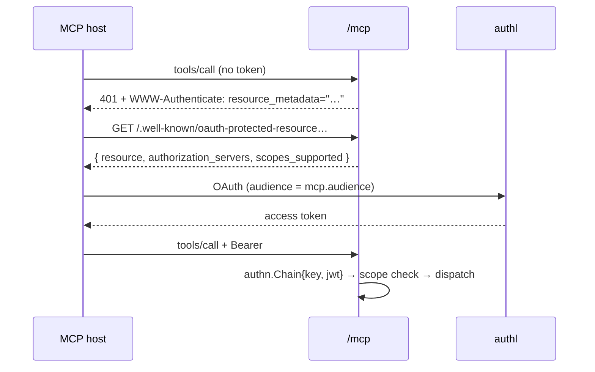

# MCP

Surface S7. Publishes control-plane RPCs as tools an MCP host can call. A tool and its RPC are
one verb reached two ways — no tool has its own implementation.

Rules: [`surfaces`](../surfaces/README.md) · Scope strings: [`scopes`](../scopes/README.md)

## Endpoints

| Path                                                  | Chain    | Credential |
| ----------------------------------------------------- | -------- | ---------- |
| `{basePath}/mcp`                                      | `MCP`    | bearer     |
| `/.well-known/oauth-protected-resource{basePath}/mcp` | `Probes` | none       |
| `/.well-known/authalune-challenge/{token}`            | `Probes` | none       |

Streamable HTTP, stateless, JSON. `MCP` chain = `edge` + `RecoverJSON` — no session, no i18n,
no SSR gate (R5).

## Setup

```bash
ALT_TOKENS_ISSUER=https://auth.example.com   # must be reachable — OIDC discovery runs at boot
ALT_HTTP_BASE_URL=https://app.example.com
ALT_MCP_ENABLED=true
ALT_MCP_CHALLENGE_TOKEN=<issued by authl>
ALT_MCP_APPS_UI=true                         # only if the host renders MCP Apps
```

Order is enforced — each step's omission is a boot error:

1. `tokens.issuer` — without it there is no verifier (`MCPIssuerRequiredError`).
2. `http.baseURL` — the audience must name this deployment (`MCPBaseURLRequiredError`).
3. `mcp.enabled=true` — the audience derives from 1–2.
4. `mcp.challengeToken` — in authl: **Resource servers → the MCP one → Start**.
   Never generate it yourself. Shown once; pressing Start again rotates it and breaks the
   deployed value. authl re-checks on a schedule, so a stale token fails admission long after
   boot looks healthy.
5. `mcp.appsUI` — optional.

| Key                    | Default                             | Meaning                                  |
| ---------------------- | ----------------------------------- | ---------------------------------------- |
| `mcp.enabled`          | `false`                             | Master switch                            |
| `mcp.audience`         | `baseURL + basePath + /mcp`         | RFC 8707 resource id the verifier pins   |
| `mcp.audienceOverride` | `false`                             | Accept an audience ≠ the mounted URL     |
| `mcp.appsUI`           | `false`                             | Publish the UI resource, bind `_meta.ui` |
| `mcp.challengeToken`   | `""`                                | Host-control proof authl fetches         |
| `mcp.challengePrefix`  | `/.well-known/authalune-challenge/` | Path the proof is served under           |

`mcp.audience` must be absolute, fragment-free, and equal the mounted URL unless
`mcp.audienceOverride=true`. The override is the only way to widen what the verifier accepts,
so it is explicit rather than inferred.

## Auth



- Chain is `authn.Chain{KeyAuthn, jwtAuthenticator}` — the same API-key authenticator the other
  planes use, plus a JWT authenticator on a **second** verifier pinned to `mcp.audience`.
  **SECURITY:** never the kernel's control-plane verifier — audience binding is what stops a
  token minted for `/api` being replayed at `/mcp`.
- Missing, malformed and rejected credentials all answer **one identical 401**.
- **A JWT is scope-checked exactly like a key — no exemption.** The control plane exempts a JWT
  because a signed-in human carries their own authority. An MCP token is a _delegated_ grant an
  agent holds for someone, so its scopes are the whole limit of that delegation.
- A tool declaring **no** scope is denied, not admitted.
- Tenant comes from the principal, not the path — `/mcp` has no org segment.
  See [`request scope`](../multitenancy/request-scope.md).

## Errors

| Where            | Shape                                                     |
| ---------------- | --------------------------------------------------------- |
| Transport 401    | HTTP 401, `ErrorPayload`, code `MCP001`                   |
| Tool failure     | HTTP 200, `result.isError = true`                         |
| Unmapped failure | Same, code `GEN900` — the cause is logged, never returned |

```json
{
  "code": "GEN003",
  "message": "credential lacks the required scope",
  "meta": { "tool": "blog_list", "scope": "posts:read" },
  "request_id": "…",
  "trace_id": "…"
}
```

**SECURITY:** a tool failure answers _in the result_, never as a JSON-RPC error — a bare error
yields a wire error with code zero, which is invalid. Codes: [`error codes`](../errors/README.md).

## Adding a tool

Steps, in order: [`howto/mcp-tool.md`](../howto/mcp-tool.md) — the annotation on a **unary** RPC,
`make generate`, the scope in `internal/mcp/scopes.go`, the two rows in
`internal/boot/mcp_tools.go`, and the smoke run. What the annotation may say, and what the generator
and boot refuse, is below.

| Field         | Effect                                                  |
| ------------- | ------------------------------------------------------- |
| `name`        | Wire name; defaults to the snake-cased method           |
| `title`       | Overrides the derived title, which mangles acronyms     |
| `description` | Falls back to the RPC's leading comment                 |
| `required`    | JSON field names marked required in the input schema    |
| `mutation`    | Clears `readOnlyHint`                                   |
| `destructive` | Sets `destructiveHint` — always sent, absent means true |
| `ui`          | Joined to `ui_prefix` to form the `_meta.ui` link       |

### The generator refuses

| Refusal                                    | Why                          |
| ------------------------------------------ | ---------------------------- |
| streaming RPC                              | a tool must be unary         |
| name ∉ `^[a-z_][a-z0-9_]{0,63}$`           | hosts key on the name        |
| duplicate name or `…ToolName` constant     | unresolvable                 |
| no description and no leading comment      | renders unlabelled           |
| `required:` naming a field the input lacks | error lists the real fields  |
| `ui:` ∉ `^[a-z][a-z0-9-]*$`                | it becomes a URI segment     |
| `ui:` with no `ui_prefix`                  | the link resolves to nothing |

Boot adds more: a duplicate or handler-less spec, a registration after the server was built,
and a `_meta.ui` naming an unpublished resource — the last panics, because it renders as a
blank panel in every host.

### UI link

`mcp.appsUI=true` publishes one self-contained bundle at `ui://altempl/app`, media type
`text/html;profile=mcp-app`, and binds every tool carrying a `ui:`:

```json
"_meta": { "ui": { "resourceUri": "ui://altempl/app" } }
```

- **Exactly one key. No flat `ui/resourceUri` sibling.** Both meta schemas are
  `additionalProperties:false`, so emitting the deprecated sibling alongside the nested key
  makes a strict host reject the pair and render nothing.
- **Must be self-contained** — the host frames it with no network, so any `src=`, `href=` or
  `@import` is a dead reference. Re-vendor with `make mcp-ui-vendor`.

## Testing

| Command                                | Covers                           |
| -------------------------------------- | -------------------------------- |
| `bash scripts/verify-mcp-smoke.sh`     | the whole wire shape, real boot  |
| `go test ./mcp/... ./internal/mcp/...` | transport, registry, scope, meta |
| `make check`                           | everything but the smoke script  |

The smoke script boots on ephemeral SQLite against a stub issuer and asserts capabilities, tool
names and schemas, `_meta.ui` carrying one key, the bundle's media type and self-containment,
the 401 challenge, an in-result scope denial, and the metadata document. Needs `go`, `curl`,
`jq`, `python3`. CI runs it as its own job.
