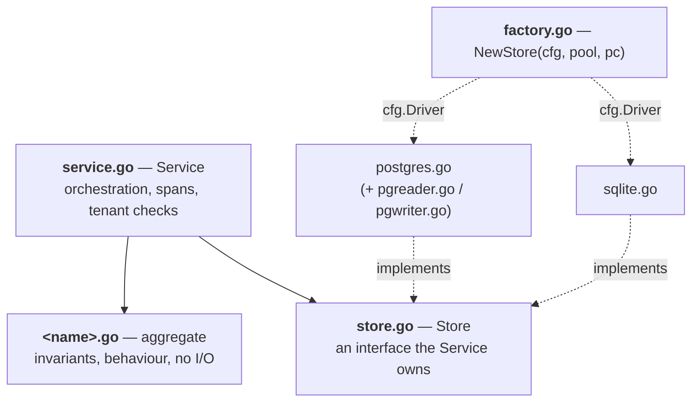

# Module template

A **module** is one bounded context under `internal/<name>/`. It owns the rules and never knows which
surface called it. Surfaces expose it; `internal/boot` introduces the two.

Reference impls: `internal/todo/` (flat) and `internal/blog/` (relations, plus `category/` and `tag/`
subdomains). Infrastructure primitives are not modules — see [`platform`](../platform/README.md).

This doc is the **shape** and is canonical for it. Ordered steps: [`howto/module.md`](../howto/module.md). The
`.agents/skills/altalune-go-convention/` skill routes to both and adds scaffolding, step order and the review traps that make a test vacuous.

## 1. Files

| File                           | Holds                                                      |
| ------------------------------ | ---------------------------------------------------------- |
| `<name>.go`                    | Aggregate root, `New()` with invariants, value types       |
| `store.go`                     | `Store` interface — the driven port                        |
| `errors.go`                    | Typed error structs, `Is<FullTypeName>`, `ToAppError()`    |
| `service.go`                   | `Service` struct, `NewService(...)`, application methods   |
| `factory.go`                   | `NewStore(cfg, pool, pc) Store` — driver dispatch          |
| `postgres.go`                  | `postgresStore` on go-jet + `tenant.PgConn`                |
| `sqlite.go`                    | `sqliteStore` on `pool.W`                                  |
| `<name>_test.go`               | Aggregate invariants, table-driven, pure Go                |
| `service_test.go`              | Application tests on `internal/testutil/fakes.<Name>`      |
| `sqlite_test.go`               | `:memory:` DB + SQLite migrations                          |
| `postgres_integration_test.go` | `//go:build integration`, `pgtest.New(t)` or `TEST_PG_DSN` |

Those names are fixed; extra files are free — `pgreader.go` / `pgwriter.go` when `postgres.go` grows (it
keeps the struct and tx helpers), `scheduler.go` (Section 6), a workflow file (Section 7), a pure domain
helper like `blog/markdown.go`.

## 2. Inside a module

**Package boundary.**

- One package per bounded context; the name **is** the domain term — `todo`, never `todoservice`.
- `<name>.go`, `store.go` and `errors.go` are import-starved, enforced by depguard's `domain-purity` rule:
  stdlib, `github.com/google/uuid`, `google.golang.org/grpc/codes`, plus `internal/platform/tenant`,
  `internal/apperror`, `gen/go/apperror/v1`, `reqid`. Nothing else.
- `service.go` adds `log/slog` and OTel and may name another module's aggregate **by ID only**; depguard's
  `application-purity` rule denies it `database/sql` and `net/http`.

**Aggregate.** Exported fields, mutations as methods (`p.Publish()`), `New(...)` enforcing creation
invariants. `time.Time` in UTC, `uuid.UUID` for ids, no JSON tags — wire shapes live in `api/` and `web/`.

**Store.** Verbs only: `Save`, `ByID`, `List`, `Delete`; never `Get*` or `Find*`. `context.Context` first.
No `*sql.Tx` in a signature — atomicity comes from the unit-of-work helpers below. Every `List` orders by a
total order (`created_at DESC, id DESC`); `created_at` alone is not one.

**Service.** Fields are `store`, `log`, `unexpected apperror.UnexpectedFunc` (a func type, not an
interface), module-specific deps after.

- Every method opens `ctx, span := tracer.Start(ctx, "<name>.<Method>")`, off a package-level
  `otel.Tracer("altalune.id/template/internal/<name>")`. Expected failures return the typed error; unexpected
  ones go through `s.unexpected(ctx, "<name>.<Method>: <situation>", err, k, v...)`.
- **A method taking a bare id checks org _and_ project.** The store filters by org only, so without it a
  sibling project's row is reachable. Shape: `category.Service.ByID`.

**Factory and adapters.**

- `NewStore(cfg db.DBConfig, pool db.Pool, pc *tenant.PgConn) Store` dispatches on `cfg.Driver`. Each module
  owns its own; there is no central `newRepos(...)`.
- Queries are go-jet statements over the bindings in `internal/platform/db/entity/{postgres,sqlite}`.
- **Never wrap jet's `NULL` singleton** — use those packages' `Null*` helpers, matched to the column's
  declared type.
- **Translate at the boundary.** A driver error never travels upward. Both rules, with the failure they
  cause: [`howto/store-method.md`](../howto/store-method.md).

**Errors.** One struct per failure mode, no sentinel `var Err*`, no `Kind int`. Bodies: [`howto/errors.md`](../howto/errors.md).

- Helper is `Is<FullTypeName>` — `InvalidTitleError` → `IsInvalidTitleError`. Never `IsErr*`.
- `Error()` reads `<module>: <situation>: <cause>`. `ToAppError() *apperror.AppError` returns the code
  (`apperror.CodePostNotFound`); wire code calls `apperror.AsAppError`, never a type switch.
- Each code is a constant in `internal/apperror/codes.go` **and** a row in [`error codes`](../errors/README.md);
  `internal/apperror/codes_test.go` checks both directions.

## 3. Tenant scoping

- **Every query carries an explicit `org_id` predicate from `tenant.From(ctx)`.** RLS is the backstop, not
  the guard — SQLite has none, and a `BYPASSRLS` role slips past Postgres.
- **An upsert's conflict clause carries the tenant predicate**, plus a `RowsAffected() == 0` branch returning
  `&NotFoundError{}` — otherwise a `Save` carrying another org's row id rewrites that org's row.
  `TestStoreUpserts_GuardConflictClauseByOrg` (`schema/upsert_tenant_guard_test.go`) fails the build on an
  unguarded `DO_UPDATE`; builder form in [`howto/store-method.md`](../howto/store-method.md).
- **Migrations are goose files run through Go's `text/template`** — `schema/migrations/{postgres,sqlite}/NNN_<name>.sql`,
  with `{{.Schema}}`, `{{.TablePrefix}}` and `{{.RLSEnforce}}`. What a tenant-scoped table must carry, and the
  `make tenant-tables` that registers it: [`multitenancy`](../multitenancy/README.md#adding-a-tenant-scoped-table).
- **A guard's test must run where the guard is the only protection** — on an RLS-enforcing fixture a hijack test
  passes with or without the code under test. Put those on SQLite or a superuser fixture; prove each by reverting the guard.
- **Unit of work.** `db.RunInTx(ctx, pool, fn)` for flows with no tenant, `tenant.RunInTx(ctx, pc, tc, fn)` for
  scoped ones; both fill the same `db.CurrentTx` slot and nesting returns `db.ErrNestedUnitOfWork`. A store
  method joins an outer transaction when `db.CurrentTx(ctx)` holds one and opens its own otherwise
  (`todo.postgresStore.txAcquire`). Primitives table: [`multitenancy`](../multitenancy/README.md#unit-of-work).

How a request acquires its scope: [`request scope`](../multitenancy/request-scope.md).

## 4. Optimistic concurrency

Only if the module needs it — `blog` does, `todo` does not.

- `Store.Save(ctx, p, ifVersion)` and `Delete(ctx, id, ifVersion)` take the expected version. **`0` writes
  unconditionally**; a mismatch returns `*StaleVersionError`.
- `ifVersion` threads from the surface down to the store. It is a request field, never a value the service
  invents.
- **A conditional write must be one write** — `blog.Service.UpdateWithTags`, pinned by
  `internal/blog/update_atomic_test.go`. What interleaves without it: [`howto/service-method.md`](../howto/service-method.md).

## 5. Surfaces

A module is reached, never reaching. Rules: [`surfaces`](../surfaces/README.md). Layering:
[`architecture`](../architecture/README.md).

| Surface          | Entry                          | Reaches the service | Gate                         | Adding it costs                                         |
| ---------------- | ------------------------------ | ------------------- | ---------------------------- | ------------------------------------------------------- |
| S1 console       | `web/handlers/blog.go`         | direct              | `Deps.RequireProject`        | A handler plus templates, routed on the console chain   |
| S2 control plane | `controlplane/blog_service.go` | direct              | `controlplane/scopes.go`     | `api/<name>/v1/*.proto`, `make generate`, a service     |
| S3 data plane    | `dataplane/blog.go`            | `Posts` port        | `apikey.Authorize` per route | A port on `HandlerParams` + a shim in `boot/shims.go`   |
| S7 mcp           | generated tool                 | via the S2 handler  | `internal/mcp/scopes.go`     | An `mcp.v1.tool` annotation, a scope, two manifest rows |

- **One instance, four doors.** `boot` builds `*blog.Service` once in `internal/boot/services.go` and hands
  the same pointer to every surface. `TestMCP_ToolsShareTheConnectHandlerInstance` asserts identity with
  `require.Same` — two services that behave alike can still diverge on tenant scoping.
- **A console handler calls `Deps.RequireProject`** (or `RequireOrg`), never its own `OrgScopeFor` →
  `ProjectScopeFor` chain. A guard test enforces it.
- **A machine surface means scope strings** — catalog in [`scopes`](../scopes/README.md), then mapped per surface.
  An RPC missing from `controlplane/scopes.go` is denied; `TestEveryRPCHasAScope` pins that.
- **Boot refuses a half-wired surface.** An MCP verb needs its scope in `internal/mcp/scopes.go` **and** rows
  in `mcpToolDomains()` / `mcpToolManifest()` (`internal/boot/mcp_tools.go`); `assertMCPWiring` and
  `assertMCPTools` fail boot on either half. Detail in [`mcp`](../mcp/README.md).

## 6. Periodic work

`scheduler.go` holds a `Scheduler` with `SchedulerJobs() []scheduler.Job` (`scheduler.Provider`). Reference:
`internal/todo/scheduler.go`.

- A `Job.Run` body calls the module's own `Service` — never a `Store`, never another module. Cadence is a
  package constant; only the timezone is operator-tunable (`scheduler.jobs.<name>.timezone`).
- A `ScopeTenant` job's `Run` gets an **already tenant-bound ctx** — the runner fans out over tenants, so the job
  handles no `org_id` itself. A `ScopeSystem` job runs once per tick, unscoped.
- Register in `internal/boot/schedulers.go` and list the module in `schedulerDomains`;
  `assertSchedulerWiring` fails boot on a missing slot.

## 7. Stateful workflows

A `Service` method needing 3+ deps beyond `store/log/unexpected` becomes its own struct in its own file —
`internal/user/onboard.go`, `internal/invite/send.go`, `internal/invite/accept.go`, `internal/auth/local.go`,
`internal/auth/oidc.go`. Constructor plus one primary method, composed by the `Service`. Otherwise it stays a
function.

## 8. Subdomains

**Add files first.** More files in one package is not a problem. Split into `internal/<name>//` only
when all three hold: its own aggregate root with its own invariants, its own `Store`, its own table.
`blog/category/` and `blog/tag/` qualify.

Cross-references are by UUID — `Post.CategoryID uuid.UUID`, never `*category.Category`. Sibling-protected helpers
go under Go's own `internal/` at `internal/<name>//internal/<helper>/`, importable only by `/` and its children. Steps: [`howto/subdomain.md`](../howto/subdomain.md).

## 9. Anti-patterns

- `internal/todo/domain/`, `application/`, `infrastructure/` — **never split by layer.**
- `TodoCreateUseCase{}.Execute(...)` — use `Service.Create(...)`.
- `Repository` / `NewRepo` / `postgres_repo.go`, or a `Store` interface in its own `repository/` package — it is
  `Store`, `NewStore`, `postgres.go`, next to the aggregate.
- Sentinel `var ErrNotFound = errors.New(...)`, or a `Kind int` inside one generic error.
- `panic` or `MustFrom(ctx)` on a missing tenant — return an error.
- Cross-module imports for persistence (`import ".../user"` inside `invite/postgres.go`).
- `database/sql` in application code; `log.Println` or `fmt.Print*` in domain code.

## 10. Adding a module

Steps, in order: [`howto/module.md`](../howto/module.md). Sections 1–9 are the contract that procedure has to
satisfy; Section 11 is what a reviewer checks once it is done.

## 11. Review checklist

Sections 2–5 are the rules; these are the things a reviewer has to look for rather than read.

- File set matches Section 1 — no `postgres_repo.go`, no `domain/` subpackage.
- Every query filters by `org_id`; every upsert's conflict clause carries the tenant predicate.
- Every `List` orders by a total order. Every DB-touching method opens a span. No `panic` on any path.
- Service tests use fakes, not a `:memory:` DB; SQLite tests pass; integration tests exist under
  `//go:build integration`. Coverage: aggregate ≥ 90%, service ≥ 85%.
- Comments: 1-line godoc on exported symbols plus `SECURITY:` / `NOTE:` / `TODO:` markers only.
- `make check` clean, depguard included.
