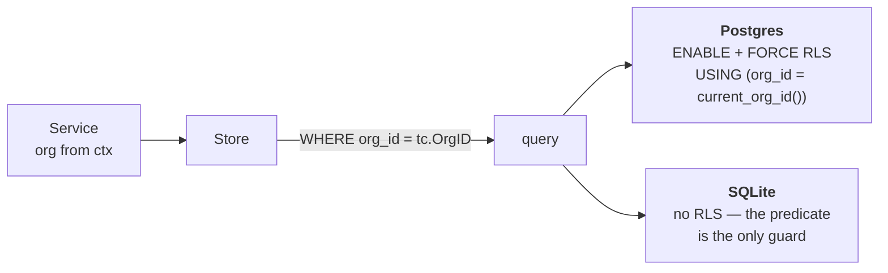
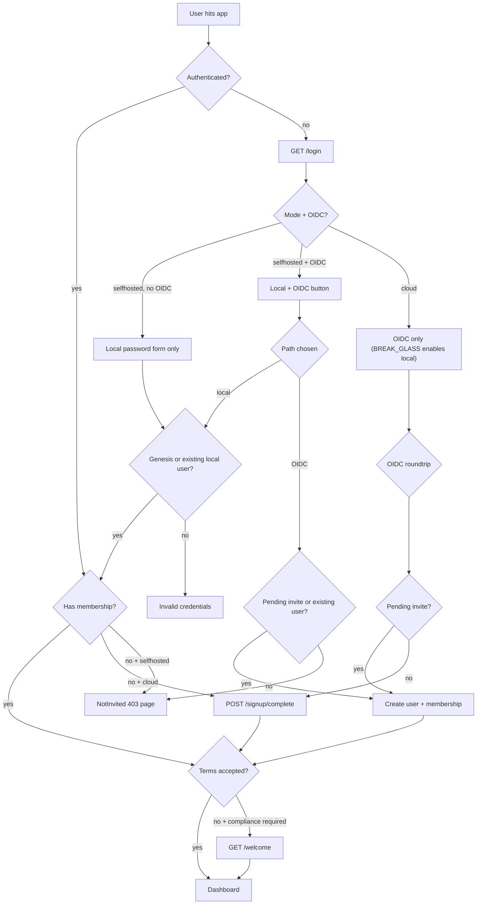

# Multitenancy — the model

What a tenant _is_ here, how the schema enforces it, and which Postgres role may bypass it.
How one request acquires its org is the other half:
[`request-scope.md`](request-scope.md).

## The shape

| Concept        | Is                                                                                              |
| -------------- | ----------------------------------------------------------------------------------------------- |
| **Org**        | The tenant. A row in `orgs` and the unit of isolation. "Tenant" and "org" are the same thing.   |
| **Project**    | A subdivision of one org. `UNIQUE (org_id, slug)` — a slug is unique _within_ an org only.      |
| **Membership** | Binds a user to an org, with a role. **Org-level only — there is no project membership table.** |
| **Scope**      | A usable `tenant.Context` in Go **and**, inside a transaction, the GUC RLS reads.               |

Two consequences carry everywhere: a project slug alone identifies nothing, and a member of an
org reaches every project in it.

## Two guards, not one

- **Every query filters by `org_id` explicitly** — defence in depth _alongside_ RLS, never
  instead of it.
- **`FORCE`** so even the owning role is subject to its own tables' policies.
- **SQLite has no RLS**, so a SQLite-only test proves nothing about isolation.
- **Tenant tables are codegen'd** into `schema/tenant_tables_gen.go`; `make tenant-tables`
  after adding one.
- `tenant.PgConn.BeginTenanted` opens the transaction and runs
  `SELECT set_config('app.current_org_id', $1, true)` — `true` makes it transaction-local.
- **Policies never read the GUC inline.** They call `<prefix>current_org_id()`
  (`002_rls.sql`), which is `NULLIF(current_setting('app.current_org_id', true), '')::uuid`.
  A transaction-local `set_config` resets to `''`, not NULL, so an inline `''::uuid` raises
  `22P02` on every later read from a pooled connection that once served a tenant.
  `schema/tenant_policy_guard_test.go` fails a migration that inlines it.

## Postgres roles

`scripts/db/provision.sh` (`APP=altempl DB_NAME=altempl`) creates:

| Role                                  | Login | BYPASSRLS | Job                                                        |
| ------------------------------------- | ----- | --------- | ---------------------------------------------------------- |
| `altempl_owner`                       | no    | **yes**   | Owns every table and every `SECURITY DEFINER` function     |
| `altempl_migrator`                    | yes   | no        | Runs migrations under `SET ROLE altempl_owner`             |
| `altempl_service`                     | yes   | no        | The runtime connection                                     |
| `altempl_editor` / `_reader` / `_ops` | no    | no        | Human roles, granted through `scripts/db/ops.template.sql` |

- **The owner needs `BYPASSRLS`** so its `SECURITY DEFINER` wrappers can read across tenants;
  `005_definer_functions.sql` raises if the migrating role lacks it.
- **The runtime role must not have it.** `BYPASSRLS` is a role attribute, not a privilege —
  `GRANT altempl_owner TO x` does not confer it; only `SET ROLE` or a definer function does.
- `ALT_DB_MIGRATOR_DSN` → migrator (`ALT_DB_MIGRATOR_ROLE=altempl_owner`), `ALT_DB_DSN` →
  service. Boot migrates, closes that pool, then serves from the service one.
- **`schema.RLSGuard` refuses to start** when `rolbypassrls` is true for `current_user`
  (`ErrRLSBypass`), and audits every tenant table for RLS, FORCE, a scoped read policy and a
  write policy (`RLSAuditError`). `db.allowBypassRLS=true` skips both with a warning — dev only.

### Reads that run before a scope exists

Resolving a slug is what _establishes_ a scope, so it cannot go through RLS. Five
`SECURITY DEFINER` wrappers in `005_definer_functions.sql`, `EXECUTE` revoked from `PUBLIC`:

| Wrapper                                | Read by                                                    |
| -------------------------------------- | ---------------------------------------------------------- |
| `list_org_ids()`                       | `tenant.NewOrgReader` — the scheduler and dispatch fan-out |
| `resolve_org_by_slug(text)`            | `org` store `BySlug`                                       |
| `list_orgs_for_user(uuid)`             | `org` store `List`                                         |
| `resolve_invite_by_token_hash(text)`   | `invite` store `ByTokenHash`                               |
| `list_pending_invites_for_email(text)` | `invite` store `FindPendingForEmail`                       |

Every other store method opens a tenant-scoped transaction and fails without a scope.

## Unit of work

| Primitive                           | Does                                                               |
| ----------------------------------- | ------------------------------------------------------------------ |
| `db.RunInTx(ctx, pool, fn)`         | Plain transaction                                                  |
| `tenant.RunInTx(ctx, pc, tc, fn)`   | Tenant-scoped; calls `set_config` for the org                      |
| `db.ContextWithTx` / `db.CurrentTx` | Stores enroll in an outer transaction when one is on the context   |
| `db.ErrNestedUnitOfWork`            | Nesting is refused, not silently flattened                         |
| `db.Pool{W, R}`                     | Non-tenant reads (`user`, `onboard`) use `R`; tenant reads use `W` |

Tenant reads need `set_config` inside the transaction, which is why they cannot use a replica.

## Modes

|                         | `selfhosted`            | `cloud`                                          |
| ----------------------- | ----------------------- | ------------------------------------------------ |
| DB driver               | `sqlite` or `postgres`  | `postgres` only (enforced)                       |
| OIDC                    | optional                | required (enforced)                              |
| Local `/login` password | on by default           | off; `ALT_GENESIS_BREAK_GLASS=true` to re-enable |
| Org creation from UI    | disabled                | enabled                                          |
| Public OIDC signup      | disabled (invite-only)  | enabled                                          |
| Invites                 | require OIDC configured | always available                                 |

Each row is a flag derived once in `internal/platform/capabilities/capabilities.go`
(`LocalIdentity`, `OrgCreation`, `PublicSignup`, `InvitesEnabled`), so no page re-decides what
a mode means.

## How a person gets a membership

- **Invites** — `POST /orgs/{slug}/invites` stores a token hash and emails the link.
  `GET /invites/accept?token=…` cookies the token and bounces to `/login` when signed out;
  signed in, it matches the email and creates the membership.
- **Selfhosted with no OIDC blocks invite creation** (`InvitesDisabledError`) — an invitee
  would have no way to authenticate.
- **Terms gate** — `ALT_COMPLIANCE_REQUIRE_ACCEPTANCE=true` puts `WelcomeGate` in front of every
  authenticated page until `users.terms_accepted_at` is stamped. Genesis admins auto-accept.

## Adding a tenant-scoped table

Steps, in order: [`howto/module.md`](../howto/module.md) for a table that comes with a new module,
[`howto/store-method.md`](../howto/store-method.md) for a verb against one that already exists. What
the table itself has to carry:

- **Postgres** — `org_id UUID NOT NULL`, `ENABLE` **and** `FORCE ROW LEVEL SECURITY`, and a policy
  calling `{{.Schema}}.{{.TablePrefix}}current_org_id()` rather than the GUC inline.
- **SQLite** — the same table without RLS, so there the explicit `org_id` predicate is the only
  guard there is.

## Pitfalls

- **Forgetting `set_config`** → RLS hides every row. Empty results in prod, fine in dev under a
  bypassing role. Stores already use `BeginTenanted`; do not hand-roll a `Begin`.
- **Reading a tenant table before a tenant exists** → zero rows, no error. Add a definer wrapper.
- **A service taking `orgID` and not scoping to it** → a leak RLS cannot see, because the
  context is the org it trusts. Parameters scope _within_ a tenant.

## Related

[`request-scope.md`](request-scope.md) · [`architecture`](../architecture/README.md) ·
[`surfaces`](../surfaces/README.md) · [`modules`](../modules/README.md) ·
[`config`](../config/README.md#modes)
