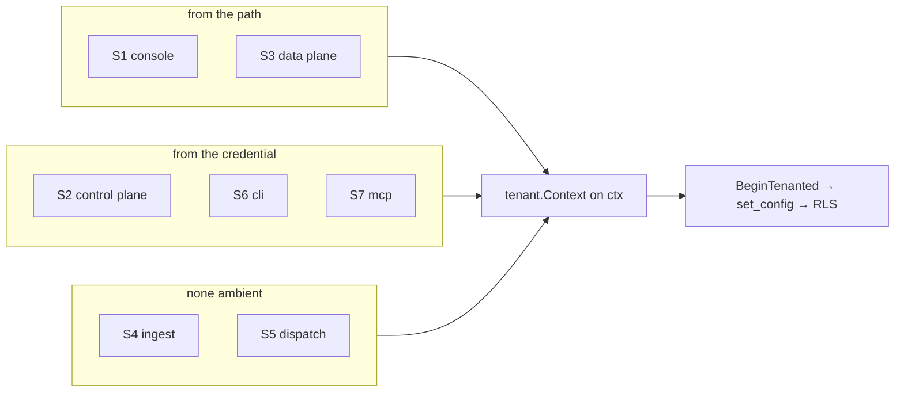

# Tenant scope in a request

How one call acquires the org it acts as, per surface. Read this before adding any tenant-scoped route. What
a tenant _is_ — schema, RLS, Postgres roles — is [`README.md`](README.md); surface names and mounts are
[`surfaces`](../surfaces/README.md).

Two independent layers: **`tenant.Context{OrgID, ProjectID, UserID}`** on a `context.Context` is what the app
_intends_, and **RLS** is what Postgres _permits_ regardless. A bug in the first is wrong-but-permitted data;
RLS is what stops it becoming a leak. Neither is sufficient alone.

## Where scope comes from

| Surface          | Scope from                            | Narrowed by                                                   |
| ---------------- | ------------------------------------- | ------------------------------------------------------------- |
| S1 console       | the path                              | org membership; **any** project in that org                   |
| S2 control plane | the principal                         | `ScopeTable()`; a project argument re-checked against the org |
| S3 data plane    | the path, **then** the key            | key's own org **and** project must match; then `ResourceIDs`  |
| S4 ingest        | nothing ambient                       | provider signature is the authz; the handler scopes itself    |
| S5 dispatch      | `tenant.Enumerator`, one pass per org | the entry's own `OrgID`                                       |
| S6 cli           | the resolved principal, or slugs      | in-process: the principal; remote: `--org` / `--project`      |
| S7 mcp           | the principal — **no path segment**   | a `projectId` argument checked against the principal's org    |

Two non-surface sources: the **scheduler**, on the same `tenant.Enumerator` fan-out, and **boot / onboarding**,
which enters the org it is creating because none exists yet.

Per-surface steps live in [`howto`](../howto/README.md). This document is the contract every one of those
recipes satisfies, plus one rule none of them states: **resolve scope with that surface's own primitive —
never hand-build a `tenant.Context`.** The in-process CLI is the single exception, because there is no request
to gate.

## S1 console — the path, gated by membership

A handler resolves its org from the path, gates membership, and passes the resulting **request** down. Call
shape: [`howto/webpage.md`](../howto/webpage.md).

- **`Principal.ActiveOrgID` never scopes data** — only the post-login redirect and the org switcher read it.
- **Use `sc.req`, not the original `r`** — the scoped request replaces the unscoped one, so a later
  `r.Context()` cannot be the wrong scope.
- **Call `RequireOrg` / `RequireProject`, never `OrgScopeFor` / `ProjectScopeFor`.** That sequence is the only
  thing separating one org's members from another org's rows, so it lives in
  `internal/web/handlers/scope.go` once. `TestTenantGateIsNotCopiedIntoHandlers` fails the build on a handler
  that rebuilds it.
- **Link with `LayoutData.OrgPath` / `ProjectPath`** and pass the org to the layout via `LayoutForOrg` /
  `LayoutForProject`. Omit it and the switchers fall back to the session.

### What `RequireProject` does not check

**Membership is org-level. There is no project membership.** `RequireProject` therefore admits **any** project
in an org the caller belongs to — the model, not an oversight. Deciding against it means adding a table, not a
check.

| Question                                                     | Answer                                                                            |
| ------------------------------------------------------------ | --------------------------------------------------------------------------------- |
| Can a member of org A reach a project in org B?              | **No.** `ProjectScopeFor` looks the slug up with `Projects.BySlug(ctx, orgID, …)` |
| Can a non-member of org A reach org A at all?                | **No.** `RequireOrg` checks `MembershipOf` first and answers 404 either way       |
| Can a member of A reach a sibling project in A never opened? | **Yes, deliberately**                                                             |

All three are pinned in `internal/web/handlers/scope_model_test.go`, the third so nobody "fixes" it by
accident. It is a **console** property, held by a signed-in human whose authority is already org-wide. No
machine credential has it.

## S2 control plane and S7 mcp — the principal

`authn.Chain` (`internal/platform/authn`) is an authenticator list tried in order; each surface builds its own
and answers with a `session.Principal` whichever member succeeded, so a key principal and a JWT principal are
interchangeable downstream.

- **S2** — `authn.Interceptor` authenticates and enforces `ScopeTable()`, then `interceptor.Tenant`
  (`internal/controlplane/interceptor/tenant.go`) reads `ActiveOrgID` / `ActiveProjectID` / `UserID` off the
  principal into a `tenant.Context`.
- **S7** — `/mcp` has **no org segment**. `internal/mcp/auth.go` authenticates and puts the principal on the
  context; the tool then calls the same control-plane method an RPC would, so it lands in the same scoping
  code.
- **A project argument narrows, it never re-targets.** `BlogService.scopeToProject` loads the project under
  the principal's `ActiveOrgID` and returns forbidden when `proj.OrgID` differs.
- **An api key's org and project are fixed when it is minted** and travel on its principal. That is the whole
  of its tenant scope: no path segment can widen it.

### A JWT's org comes from membership, never from the claim

- **The verifier puts `org_id` on `ClaimedOrgID`, never `ActiveOrgID`**
  (`internal/platform/tokens/verifier.go`), so an issuer cannot name the tenant.
- **`internal/user/authn.go` resolves the real org from the local user's membership.** A claim naming an org
  the user does not belong to refuses the whole credential, and `OrgClaimNotMemberError.Unwrap` returns
  `*authn.UnauthorizedError` so it stays a masked 401.
- **No claim resolves a lone membership**, but a multi-org user whose token names no org resolves nothing
  rather than guessing — it fails later as `UnscopedError`.
- Pinned end to end by `TestMCP_JWTResolvesItsTenantFromMembership`.

## S3 data plane — path first, then the key must agree

Mounted at `/api/v1/orgs/{org}/projects/{project}/…`. `internal/dataplane/scope.go` resolves both slugs — the
org through a `SECURITY DEFINER` wrapper, the project under the org scope just entered — and
`apikey.Authenticator.Authorize` then refuses unless `k.OrgID` **and** `k.ProjectID` equal the resolved pair.
A non-empty `ResourceIDs` narrows further, to named resources inside that project; `AuthorizeProject` demands
an _unrestricted_ project-wide grant, so a resource-pinned key fails it outright. Steps:
[`howto/external-api.md`](../howto/external-api.md).

- **Every failure is one masked `NotFoundError`** — unresolvable slug, missing row and denied key are
  indistinguishable.
- **No `authn.Chain` here**: the surface accepts keys only and a JWT is refused at the door. Scope strings:
  [`scopes`](../scopes/README.md).

## S6 cli, S4 ingest, S5 dispatch

- **CLI** is dual-mode, and so is its scope. In-process commands (`org`, `project`, `invite`) build
  `tenant.Context` from the principal `cli.Resolve` returns — the session file, or a token verified through
  `Whoami` — and enter it with `tenant.Into`. The remote `blog` commands are a data-plane client instead:
  `--org` / `--project` (or `ALT_ORG` / `ALT_PROJECT`, or the profile) become path slugs, and the API key
  still has to agree with them.
- **Ingest** is credential-free machine push under `/hooks/{provider}/`. Provider identity _is_ the
  authorization (R4), and the surface establishes **no** tenant scope of its own — the template ships no
  providers. A provider handler must derive its org from the verified payload and enter it explicitly.
- **Dispatch** is egress with no request to inherit from. `outbox.Worker` sweeps through `Tenants.Each` — the
  same `tenant.Enumerator` the scheduler uses — and drains one tenant's batch per bound context. Every
  `outbox.Entry` also carries its own `OrgID`, rejected as `InvalidEntryError` when zero.

## The enumerator

`scheduler.Job.Scope` picks the fan-out. **`ScopeSystem`** fires once per tick, unscoped, and must not touch a
tenant-scoped store; **`ScopeTenant`** fires once per tenant per tick, each with its own scoped context, and
fails at startup if `Options.Tenants` is nil rather than running unscoped. Wired in `boot.orgEnumerator`.

- **The enumeration is itself a cross-tenant read**, so it cannot go through RLS. `tenant.NewOrgReader` reads
  the `<prefix>list_org_ids()` `SECURITY DEFINER` wrapper, which runs as the owner. No separate maintenance
  login exists.
- **The scope carries no `UserID`.** A job acts as the system, so anything attributing an action to a person
  must take the actor explicitly.
- `db.NewLocker` stops two replicas running a job at once; `Job.Timeout` caps one invocation — per tenant, not
  per tick.

## Why the URL and not the session

`projects` is `UNIQUE (org_id, slug)`, so `/projects/default/todos` identifies nothing and only ambient state
could disambiguate it. With the org in the path a link means the same thing to everyone, two tabs can sit in
different orgs, back and forward behave, and the scope is a pure function of the request.

## Writes whose tenant is the row

`orgs` is scoped by its own id, so `org.Create`, `org.Rename` and `org.RemoveMember` re-point the context to
the row's org (`tenant.Into` / `tenant.WithOrg`) before touching the store — the new row's own scope is the
only one RLS accepts. Authorization there is the handler's membership check, not RLS.

**A service method taking an `orgID` parameter scopes to that parameter.** Never assume the caller passed a
context naming the same org.

## Failure modes

| Symptom                                      | Cause                                                                             |
| -------------------------------------------- | --------------------------------------------------------------------------------- |
| `tenant: missing context`                    | reached a scope-requiring store method with no scope at all                       |
| `tenant: context names no org`               | scope present but `OrgID` is the zero uuid — usually a session with no active org |
| Zero rows, no error                          | the scope names the wrong org; RLS filtered everything out                        |
| `new row violates row-level security policy` | inserting a row whose `org_id` differs from the scope                             |

`tenant.From` rejects a zero `OrgID` deliberately — it used to return an unusable scope with a nil error,
which turned each of these into its own debugging session.

## Tests holding this together

| Test                                                        | What it prevents                                           |
| ----------------------------------------------------------- | ---------------------------------------------------------- |
| `internal/boot/route_scope_test.go`                         | a route reachable without scope, or a route with no probe  |
| `TestRoutes_NonMemberCannotReachAnotherOrg`                 | reading another org by guessing its slug                   |
| `TestRequireProject_RefusesAProjectOutsideTheCallersOrg`    | reaching another org's project through your own org's path |
| `TestRequireProject_AdmitsAnySiblingProjectInTheCallersOrg` | the org-level model being narrowed by accident             |
| `TestTenantGateIsNotCopiedIntoHandlers`                     | a handler rebuilding the gate and skipping the org check   |
| `TestMCP_JWTResolvesItsTenantFromMembership`                | an issuer naming a tenant its subject has no membership in |
| `internal/org/definer_integration_test.go`                  | writes that only pass because the test role bypasses RLS   |
| `schema/tenant_policy_guard_test.go`                        | a migration inlining the GUC instead of calling the helper |

The route walk runs on SQLite, whose org store scopes by explicit argument rather than by context, so it
cannot see org-domain scope bugs. Those need the Postgres integration tests running as a **non-BYPASSRLS**
role — a test connecting as a superuser proves nothing about RLS.
