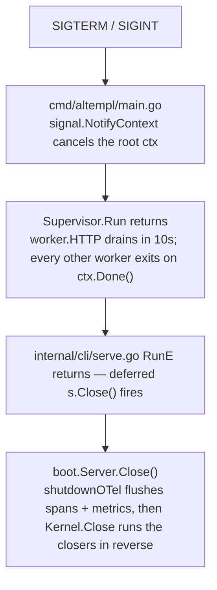

# Platform template

A **platform package** is a cross-cutting primitive domain modules depend on — DB pool, session
store, tokens, mailer, tenant scoping, worker supervisor, request IDs. Domain packages follow
[`modules`](../modules/README.md). Adding one is mechanical: one directory, one port, one
factory, one field on `Kernel`.

## What counts

- **Adapter over an external system** — `internal/platform/{db,session,tokens,outbox,notify}`,
  `mailer/`, `authl/`.
- **Cross-cutting primitive** — `logger/`, `telemetry/`, `reqid/`, `nanoid/`, `httpclient/`,
  `internal/platform/{tenant,capabilities,sealer,authn}`.
- **Long-running loop** — `worker/` (the Supervisor), `scheduler/`, `outbox.Worker`,
  `db.HealthMonitor`.
- **Not one** — domain logic (`internal/<name>/`), a surface
  (`internal/{web,controlplane,dataplane,ingest,mcp,cli}/`), a helper with one caller.

## Root or `internal/platform/`

- **Root** — `authl/ httpclient/ logger/ mailer/ mcp/ nanoid/ reqid/ scheduler/ telemetry/ worker/`.
  Downstream forks copy them verbatim, so signature changes cost every fork.
- **`internal/platform/<name>/`** — everything only this app's internals need.
- **An exported root carries no `mapstructure` tags and no deployment policy.** It takes a plain
  `Options`/`Config` struct (`scheduler.Options`, `mailer.Config`); the operator-facing knobs live
  in `internal/platform/config` (`SchedulerConfig`, `MailConfig`) and boot maps one onto the other,
  so the importable package never pulls in Viper. `logger/` and `telemetry/` predate the rule and
  still tag their own `Config` — do not copy them.
- **A root package must not import `internal/`** — depguard rule `platform-boundary-root`.

## Required files

| File                    | Required?             | Purpose                                            |
| ----------------------- | --------------------- | -------------------------------------------------- |
| `<name>.go` or `doc.go` | Yes                   | Package godoc + the port type or interface         |
| `<name>_test.go`        | Yes                   | Covers every exported symbol                       |
| `config.go`             | If cfg-driven         | `Config` + defaults, `Validate()` when non-trivial |
| `errors.go`             | If ≥ 1 typed error    | Typed structs + `Is<TypeName>` + `ToAppError`      |
| `options.go`            | If functional options | `type Option func(*settings)` + `With*` builders   |
| `factory.go`            | If > 1 backend        | `New…` dispatching on `cfg.Driver` / `cfg.Kind`    |
| `<backend>.go` + test   | Per backend           | `postgres.go`, `sqlite.go`, `memory.go`            |

## Conventions

**Constructor**

- **One per package** — `New` (`mailer.New(cfg Config) (Mailer, error)`) or `New<Thing>` for a
  factory (`session.NewStore(cfg, pool, sealer, unexpected) Store`).
- **Return the interface** when backends are swappable, the concrete `*T` otherwise.
- **No package-level singletons, no `Init()`/`MustInit()`** — importing does nothing.
- **`ctx` first** if the constructor performs I/O; **`Close() error`** if it holds resources.
- **Required inputs are positional.** Options cover testing seams (clock, RNG, fakes) and rare
  knobs — `httpclient/options.go` and `mcp/options.go` are the shape.

**Config**

- Each cfg-driven package owns its `Config` in `config.go`; `internal/platform/config.Config`
  embeds them.
- **Env binding is automatic** from the yaml path — `http.baseURL` ← `ALT_HTTP_BASE_URL`, walked by
  `BindEnv` in `internal/platform/config/`.
- **Every field carries an `awareness:"..."` tag** (`required`/`bootstrap`/`secret`/`mode:<x>`).
- `make config-examples` regenerates `.env.example` and `config.example.yaml`; CI fails on drift.

**Errors**

- **One struct per failure mode**, helper `Is<FullTypeName>` (`IsMissingConfigError`) — never
  `IsErr*`, never a shortcut.
- **`ToAppError() *apperror.AppError`** on anything that reaches a wire.
- **Unexpected failures go through `apperror.UnexpectedFunc`** taken at construction — a func type,
  like `http.HandlerFunc`. `session.NewStore` substitutes a discard when it is nil.
- **Never `panic`** outside `TestMain`.

**Logging + telemetry**

- **Accept a `*slog.Logger`**; `forbidigo` fails a call on the `slog` default.
- **Tracer and meter are injected** from `Kernel.Tracer`/`Kernel.Meter` — `db.NewHealthMonitor`
  takes a `metric.Meter` and no-ops on nil. Package-level `otel.Tracer(…)` belongs to domain
  services, not here.

## Long-running loops

```go
type Worker interface {
    Name() string
    Run(ctx context.Context) error
}
```

`sup.Register(x)` in `internal/boot/server.go` adds it; `Supervisor.Run` runs every worker under
one errgroup and returns the first non-nil error.

1. **Return `nil` on graceful shutdown** (ctx canceled) — never `ctx.Err()`.
2. **Return non-nil only on unrecoverable failure** — the errgroup cancels every sibling.
3. **Never block cancellation past the graceful window** — 10s, `worker.HTTP`'s shutdown budget.
4. **A periodic loop logs per-tick failures instead of returning them.** `db.HealthMonitor` swallows
   probe errors for exactly this reason: a database blip must not kill the process.

| Choose          | When                                                                                                                                           |
| --------------- | ---------------------------------------------------------------------------------------------------------------------------------------------- |
| scheduler `Job` | At most one replica does the work per tick, or an operator triggers it by name (`altempl scheduler run <job>`)                                 |
| `worker.Worker` | Every replica needs its own result (per-process state, a health snapshot), or per-tick failures must not reach the scheduler's `ErrorReporter` |

## Import boundary

depguard in `.golangci.yaml` is the source of truth.

| Rule                     | Scope                                                                       | Effect                                                                 |
| ------------------------ | --------------------------------------------------------------------------- | ---------------------------------------------------------------------- |
| `platform-boundary`      | `internal/platform/**`                                                      | Denies `internal/{todo,user,org,project,invite,auth,api,web,cli,boot}` |
| `platform-boundary-root` | `authl/ httpclient/ logger/ mailer/ mcp/ nanoid/ reqid/ telemetry/ worker/` | Denies all of `altalune.id/template/internal`                          |
| `mcp-purity`             | root `mcp/` only                                                            | Allows only stdlib + the MCP Go SDK                                    |
| `scheduler-purity`       | `scheduler/`                                                                | stdlib, otel, `robfig/cron/v3`, `reqid`                                |
| `httpclient-purity`      | `httpclient/`                                                               | stdlib, `resty/v2`, `otelhttp`                                         |

A platform package MAY import stdlib, the third-party library its adapter needs,
`internal/apperror`, and a narrow set of siblings (`tenant`→`apperror`, `tokens`→`session`,
`notify`→`apperror`+`mailer`).

## Adapters

One port, several backends, one factory. Reference: `internal/platform/session/`.

- `session.go` declares `type Store`; `factory.go` switches on `cfg.Driver`; `memory.go`,
  `postgres.go` and `sqlite.go` implement it.
- **One contract suite, run against every backend** — `store_contract_test.go` exports
  `runStoreContract(t, newStore func(t *testing.T) session.Store)`, called once per backend (memory
  there, plus `sqlite_test.go` and `postgres_integration_test.go`).
- A divergence between backends is a bug or a documented difference, never a second suite.

## Shape variants

| Variant             | Reference impl                                  | What differs                                                           |
| ------------------- | ----------------------------------------------- | ---------------------------------------------------------------------- |
| Single primitive    | `reqid/`                                        | One file + test. No config, no I/O, no `Close`                         |
| Adapter             | `internal/platform/session/`                    | `factory.go` + the contract suite above                                |
| Worker              | `internal/platform/outbox/`, `db.HealthMonitor` | Implements `worker.Worker`; `sup.Register` in boot                     |
| Worker owning jobs  | `scheduler/`                                    | Many `Job`s; per-job config under `config.SchedulerConfig.Jobs`        |
| Producer + consumer | `internal/platform/outbox/`                     | Producer is a `Store` registered as a Closer; consumer is the `Worker` |

## Boot — the Kernel

Every primitive is one field on `platform.Kernel` (`internal/platform/platform.go`): `Pool`,
`PgConn`, `Log`, `Reporter`, `Sessions`, `Sealer`, `Verifier`, `Mail`, `AltAuth`, `Tracer`,
`Meter`, `Notify`, `Nano`, `Caps`, `Outbox`, plus an unexported `closers []io.Closer`.

- **`AddCloser` then `Close`** — `Close` walks `slices.Backward(closers)` and returns
  `errors.Join`. Reverse order means the last thing built is the first torn down, so a dependent
  flushes before what it depends on disappears.
- **Boot registers notify sinks first, then the pool** (`internal/boot/server.go`) — the pool closes
  first and the sinks last, so an incident raised during shutdown still has somewhere to land.
- **A `Service` never reaches into `Kernel`.** It takes what it needs as a constructor param.



Exit is code 0: `context.Canceled` maps to `ExitOK` in `internal/cli/exit.go`.

## Adding a primitive

Steps, in order: [`howto/platform-primitive.md`](../howto/platform-primitive.md) — directory, port,
constructor, tests, the `Kernel` field, then `make config-examples`. Everything above is the
contract it has to satisfy. Two requirements that procedure does not carry:

- **Package name is a noun** — `session`, `outbox`, `tokens`. Never `pkg`, `util`, `common`.
- **A worker's tests cover `Run(ctx)` cancellation**, on top of the exported-symbol coverage every
  package here owes.

## Anti-patterns

- Package-level singletons (`var Global = …`), or `Init()`/`MustInit()` with import side effects.
- A goroutine started at construction — it belongs in `Run(ctx)` under the Supervisor.
- A platform package importing a domain package or a surface.
- A cross-import between platform packages outside the allow-list.
- `time.Sleep` in a loop — use a `time.Ticker` plus `ctx.Done()`.
- `log.Println`, `fmt.Print*`, or the `slog` default instead of the injected logger.
- A `panic` for an expected failure mode.
- Shared mutable state with no `Close()`.
