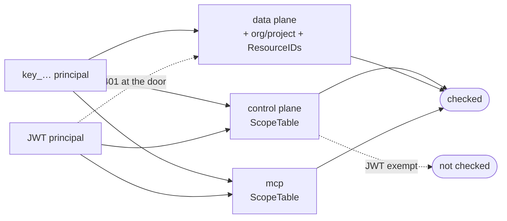

# Scopes

Wire contract. Keys store these exact strings; integrators type them; MCP hosts read them from
the metadata document. **Additive only** — renaming one invalidates keys in the field.

Defined in `internal/platform/authn/scope.go`. `authn.Valid()` gates minting.

## Catalog

| Scope           | Grants                             |
| --------------- | ---------------------------------- |
| `posts:read`    | Read posts and todos               |
| `posts:write`   | Create, update, publish, unpublish |
| `posts:admin`   | Delete a post or todo              |
| `apikeys:read`  | List keys; `Whoami`                |
| `apikeys:write` | Create and revoke keys             |

- **No implication.** `posts:admin` does not grant `posts:write`. The check is
  `slices.Contains`. A key needing read + delete holds both strings.
- **`posts:*` spans `blog` and `todo`.** A fork splitting them adds its own strings.

## Enforcement

| Surface       | Enforced by                             | Applies to               |
| ------------- | --------------------------------------- | ------------------------ |
| control plane | `authn.Interceptor` + `ScopeTable()`    | keys only — JWT exempt   |
| data plane    | `apikey.Authorize` per route            | keys only — JWT gets 401 |
| mcp           | `mcp.Server.authorize` + `ScopeTable()` | **everyone, JWT too**    |
| console       | session membership and role             | —                        |

Two asymmetries, both deliberate:

- **Control plane exempts a JWT** — a signed-in human carries their own authority. A procedure
  missing from the table is **denied**, not admitted; `TestEveryRPCHasAScope` pins it.
- **MCP exempts nobody** — an MCP token is a delegated grant an agent holds for a person, so
  its scopes are the limit of that delegation. See [`mcp`](../mcp/README.md).

The data plane narrows past the scope: the key's org and project must equal the path's, and a
non-empty `ResourceIDs` confines it to named resources.

## Adding one

A new string starts in two places, both of them here:

1. Constant + `allScopes` entry in `internal/platform/authn/scope.go`.
2. A row in the catalog above.

Mapping it onto a surface is that surface's own procedure:
[`howto/internal-api.md`](../howto/internal-api.md) for `internal/controlplane/scopes.go`,
[`howto/external-api.md`](../howto/external-api.md) for the `authorize` calls in
`internal/dataplane/`, [`howto/mcp-tool.md`](../howto/mcp-tool.md) for `internal/mcp/scopes.go`.

Never remove a scope — stop mapping it instead. Keys holding it keep validating and grant nothing.
